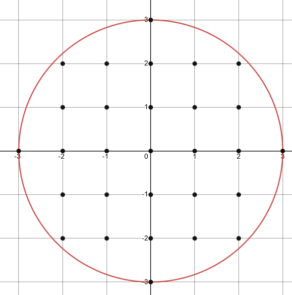

# In Circle

## Problem Statement

Write a program that takes in a radius of a circle, and outputs the number of points within that circle that exist on integer points, including points that lie on the edge of the circle.

An integer point is defined as a point (x, y) where BOTH x and y are integers.

### Example

In this example the input was 3. In the image above, we can count a total of 29 different integer points (in black) within the circle or on its border. Therefor, the output of this circle would be 29.

## Input

This program will take a positive integer as its input. Reminder, you do NOT need to do any form of input validation. This input can be in any form (stdin, program arguments, etc).

## Output

The number of integer points within the circle (or on the edge of it). The output could either be through stdout or an exit code.